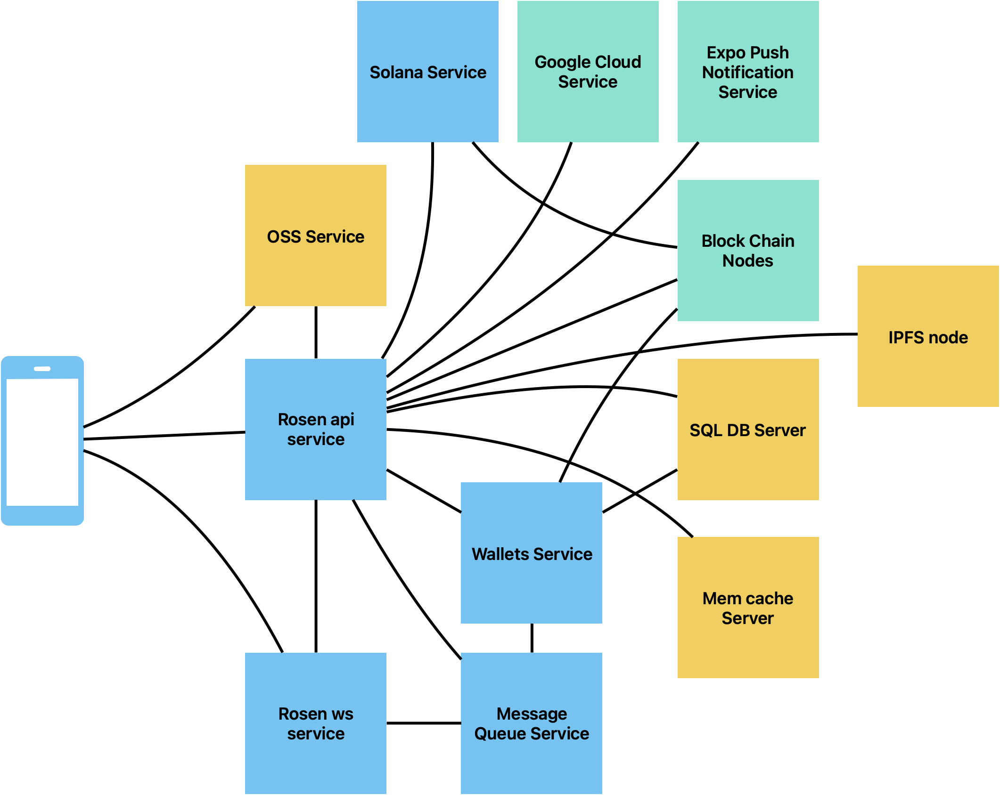

# Rosen Open Source

## About

Rosen App is the #1 social business platform built on stablecoins, designed to connect, transact, and empower users worldwide. By leveraging cutting-edge technology and innovative features, Rosen breaks down traditional barriers—language, borders, and financial inequality—to create a truly global community where everyone can thrive.

In Rosen, you can 

**Connect borderless**

Effortlessly communicate across the globe with our AI-powered real-time multilingual translation, breaking down language barriers and ensuring instant, transparent information exchange.

**Transact borderless** 

Experience seamless, fee-free payments with stablecoins. Send money to anyone, anywhere in just seconds, removing barriers to cross-border transactions.

**Earn borderless**

Share what you want and what you offer to find the perfect match worldwide. Build connections, make friends, and uncover endless earning opportunities while redefining your identity and status - no matter your background or location.

[Home Page](https://gorosen.xyz)

## Quick Start

You can download our App from [App Store](https://apps.apple.com/us/app/rosen/id6444627514) / [Google Play](https://play.google.com/store/apps/details?id=com.rosenbridge.rosen&pli=1) for a quick experience.

And you can also download the [Beta Version](https://expo.dev/accounts/rosen-bridge/projects/rosen/builds/4efa0f19-da05-450a-a2c6-3a562d60ebbc) for new features such as PYUSD supports.

## Start from Scratch

You can also start from building with our source code.

### Architecture



### Build & Run Client

```
cd client
npm i
npm run dev
```

### Build & Run Server

1. requirements: 

  - golang >= 1.23.4
  - mysql >= 8.0
  - redis

2. build

```
cd server-contract
go mod download
go build
```

2. Edit ```config.yaml``` with your favorate editor. e.g. ```vim```

```
vim config.yaml
```

3. Launch for first time.

```
./rosen-apiserver server --config config.yaml --migratedb yes
```
